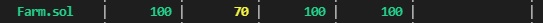

# Form Uniswap-v2

 - [Token1(Kovan)](https://kovan.etherscan.io/address/0xF4FcD0f8F5424E97C58dc5847A8Fa52BA329C247)

 - [Token2(Kovan)](https://kovan.etherscan.io/address/0x001d85C64e3a83cc41a2e8519FDd11dA5d296D5f)

 - [LP Token(Kovan)](https://kovan.etherscan.io/token/0x053a03f2b6bbf5031c9bb95b4a05d937408c9fb0)

 - [Pair Contract(Kovan)](https://kovan.etherscan.io/address/0x63858f70bc45204d28b96196e6c0713bfa36b7fb)

 - [Farm Contract(Kovan)](https://kovan.etherscan.io/address/0xE2ecE4017cAF232E5187b30004caeE0126e1ac1e)

# Coverage

